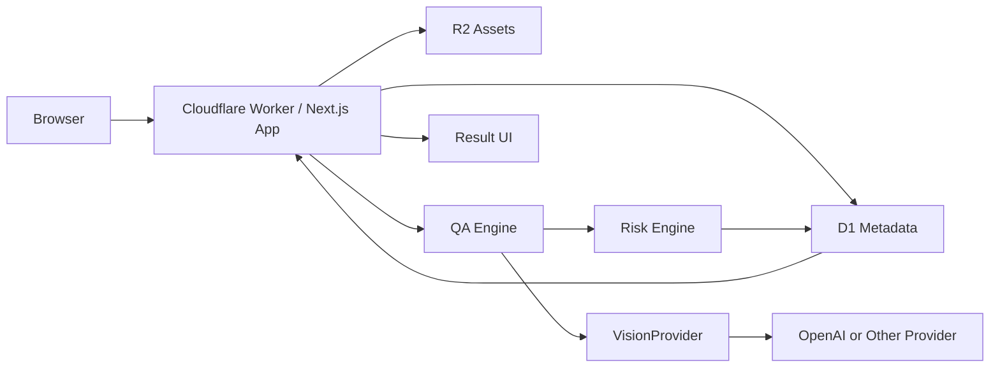
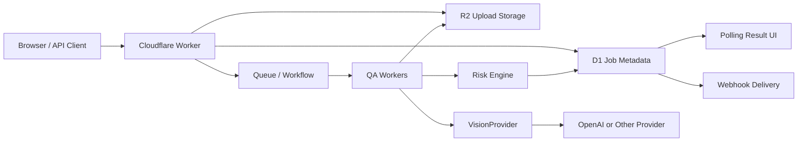

# System Design

## M0/M1 Synchronous Path

Used for single reference + candidate analysis.



## Future Asynchronous Path

Used for batch, API, marketplace rule packs, and long-running analysis.



## Core Components

### Browser / UI

- Upload trusted reference image.
- Upload candidate image.
- Show progress without fake percentages.
- Display verdict, issues, evidence, passed checks, technical details, and feedback.

### Cloudflare Worker

- Render app through Next.js/OpenNext.
- Authenticate users and anonymous sessions.
- Issue signed upload URLs.
- Initiate analysis.
- Enforce usage limits.
- Retrieve result state.
- Serve public API in later phases.

### R2

Stores image binaries and derivatives:

- original uploads;
- normalized analysis versions;
- thumbnails;
- reference assets;
- generated reports if required.

Object layout:

```text
workspaces/{workspaceId}/products/{productId}/references/{assetId}
workspaces/{workspaceId}/analyses/{analysisId}/candidates/{assetId}
anonymous/{sessionId}/{assetId}
```

Never store image binaries in D1.

### D1

Stores transactional metadata:

- users, workspaces, memberships;
- assets and products;
- analyses, checks, issues, model calls;
- rule sets and rules;
- feedback and evaluation metadata;
- usage ledger and subscriptions;
- API keys and webhooks;
- audit and deletion jobs.

D1 should be hidden behind repository interfaces so it can later be migrated, replicated, or sharded.

### QA Engine

Coordinates:

- deterministic checks;
- product fidelity checks;
- marketplace rule checks later;
- risk aggregation;
- domain result normalization.

QAEngine should remain domain-focused. Application and infrastructure services own R2, D1, queues, persistence, provider transport, auth, billing, and operational telemetry persistence.

### VisionProvider

Provider abstraction for multimodal analysis. The rest of the application does not depend on provider-specific raw output.

### Risk Engine

Converts normalized observations into final `PASS`, `REVIEW`, or `FAIL` according to a versioned risk policy.

## Pipeline

1. Ingest: validate MIME type, size, checksum, duplicate uploads, EXIF orientation, and original storage.
2. Normalize: create bounded analysis image and thumbnail; keep original.
3. Technical checks: dimensions, aspect ratio, decode, file size, blur, background, transparency.
4. Product fidelity: compare candidate with references and category context.
5. Rule evaluation: later marketplace checks against versioned rule sets.
6. Risk aggregation: final verdict from risk policy.
7. Persistence: store result, issue evidence, model calls, versions, costs, and latency.
8. Feedback: collect human correction signals.

## External Analysis Resource Contract

Even if M0 executes synchronously internally, the external contract should support asynchronous evolution:

```text
POST /analyses -> analysis_id
GET /analyses/{analysis_id} -> queued / running / completed / failed
```

The frontend should not permanently assume that every analysis completes inside one HTTP request. Do not introduce Queues/Workflows into M0 unless required, but preserve the resource semantics.

## Cloudflare Constraints

Cloudflare Workers are a good fit for edge app/API orchestration, signed uploads, and short single-image workflows. For batch or long-running work, use Queues/Workflows and store binary data in R2.

Design constraints:

- avoid buffering large image binaries in Worker memory;
- keep Worker bundle size controlled;
- use object IDs in queue messages, not image bytes;
- make queue jobs idempotent and retry-safe;
- add dead-letter or failed-job states;
- record cost before marking usage billable.

## Versioning

Every analysis records:

- `qa_engine_version`
- `risk_policy_version`
- `model_policy_version`
- `rule_set_version`

Every model call records:

- `provider`
- `model`
- `prompt_version`
- `latency`
- `cost`

This enables auditability, evaluation comparisons, and controlled rollout.

## Security Baseline

- secure cookies;
- CSRF protection where applicable;
- content-type validation;
- signed R2 uploads;
- random object keys;
- private raw asset bucket;
- hashed API secrets;
- Turnstile for anonymous expensive flows;
- rate limits;
- audit events for critical actions;
- tenant isolation on every customer data query.
